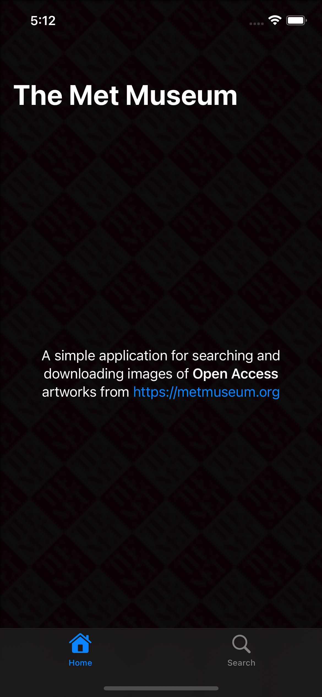
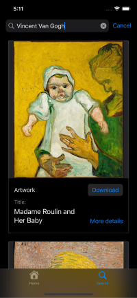
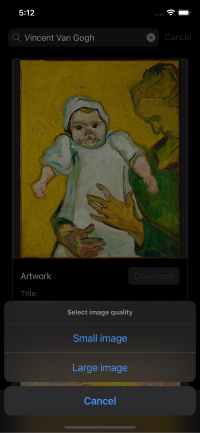
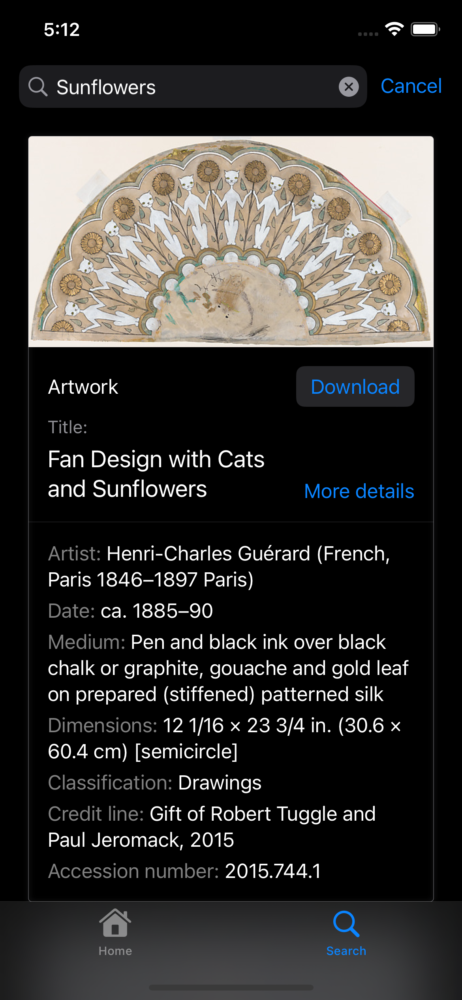

# MetMuseum
The Metropolitan Museum of Art - iOS application

### About
This is an open source app made to search artworks from MetMuseum.org by open API and easy download public images. 

### What I learned
 * NavigationView .searchable view modifier
 * Swift Modern Concurrency with Async/Await, TaskGroup
 
## Screenshots
 

 

